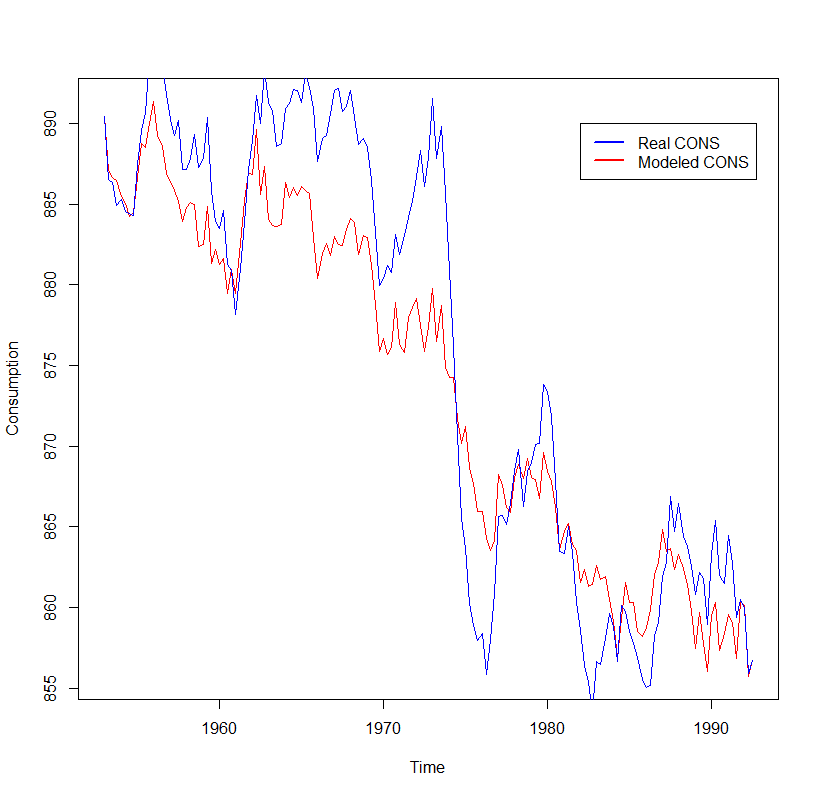

# Macroeconomic model with R

A linear difference model explains total consumption of a national economy as a function of total income and inflations. Differences in income and inflation are used as independent variables because in a ordinary regression model residuals were found to be autocorrelated. That indicates the data contains information not being considered in the model. 

The sample data used is publicly available by Aalto universty course [MS-C2128 - Ennustaminen ja aikasarja-analyysi][1]

[1]:https://mycourses.aalto.fi/mod/assign/view.php?id=70445
